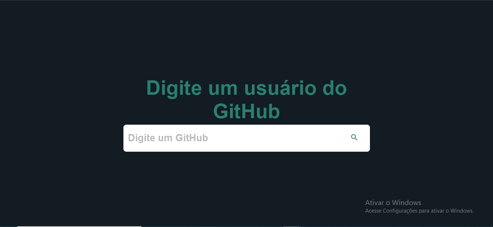
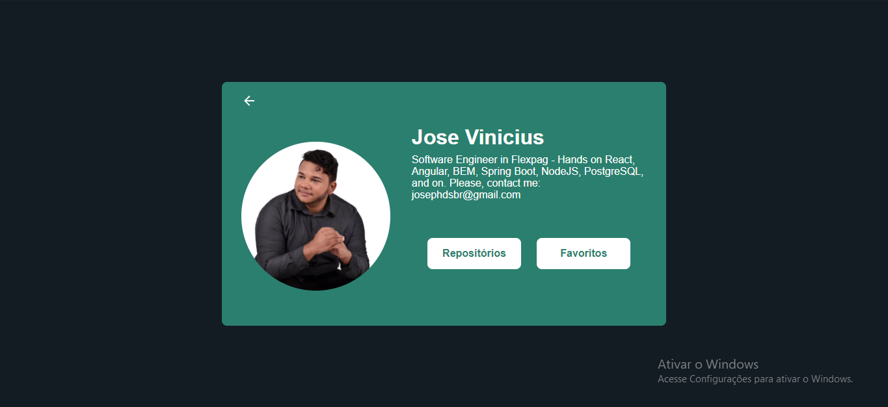
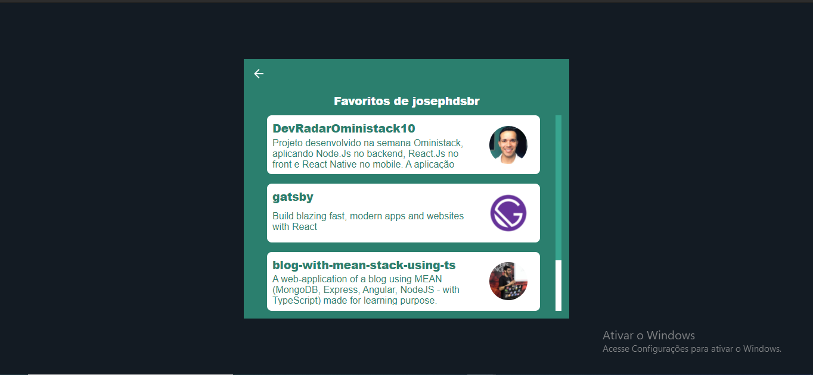

<h1 align="center">GitHub User Explore</h1>
<p>Projeto desenvolvido para ser utilizados como ferramento de consulta rápida aos repositórios e outros detalhes de profissionais da área de Tecnoliga utilizando a API do Github</p>

Tabela de Conteúdo
##################
<p align="center">
  <a href="#informacoes">Informações</a>
  <a href="#features">Features</a>
  <a href="#telas">Telas</a>
</p>

<h4>Em desenvolvimento</h4>

### Informações

Você pode visualizar a aplicação através deste [link](https://github-repositoty-client.vercel.app).

### Features

- [x] Configurações de `lint` para padronizar a estilização do código.
- [x] Configurações do `babel` e `next` para utilização de componentes de estilização.
- [x] Criação de um **Hook** para a utilização do [SWR](https://swr.vercel.app/) como estratégia de performance.
- [x] Configuração para utilização do [Styled-Components](https://styled-components.com/)
- [x] Desenvolvimento do componente de busca, utilizando como parâmetro o usuário do Github.
- [x] Desenvolvimento da tela de detalhes do Usuário.
- [x] Desenvolvimento da tela de detalhes dos repositórios do usuário.
- [x] Desenvolvimento da tela dos repositórios favoritos do usuário.
- [x] Implementação do [`nprogress`](https://ricostacruz.com/nprogress/) como indicador de loading entre as páginas (simulando um ambiente parecido com SPAs).

### Telas

#### Mobile

* Tela Inicial


* Tela de detalhes do usuário


* Tela de detalhes dos repositórios


* Tela de detalhes dos repositórios favoritos


#### Desktop

* Tela Inicial



* Tela de detalhes do usuário



* Tela de detalhes dos repositórios


* Tela de detalhes dos repositórios favoritos



### [Pré-requisitos](#pre-requisitos)

Antes de começar você vai precisar ter instalado em sua máquina:

- [NextJS](https://nextjs.org/docs/api-reference/cli)
- Um Package Manager ([NPM](https://www.npmjs.com/) ou [Yarn](https://yarnpkg.com/))
- [Git](https://git-scm.com/)

### [Instalação](#instalacao)

```bash

# Clone do repositório

$ git clone https://github.com/josephdsbr/github-repository-client.git

# Acesse a pasta do projeto no terminal/cmd

$ cd github-repository-client

# Instale as dependências

$ npm install ou yarn
```

### [Como Usar](#como-usar)

Este projeto está utilizando o Framework [NextJS](https://nextjs.org/) que utiliza, por padrão, o **SSR** (Server Side Rendering). Deste modo, para *startar* o projeto, em ambiente de desenvolvimento, deve-se executar o seguinte comando `npm run dev` ou `yarn dev`.
